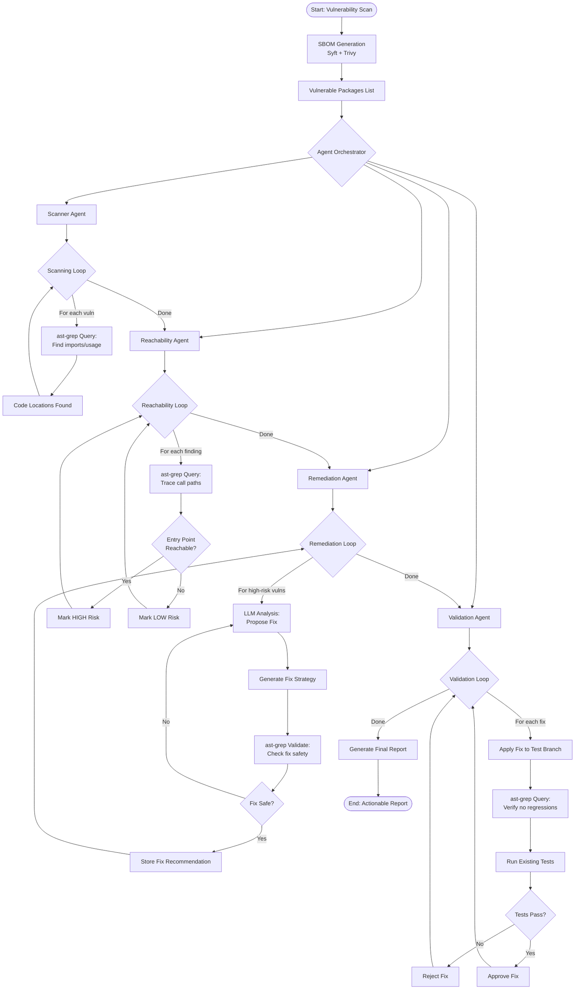
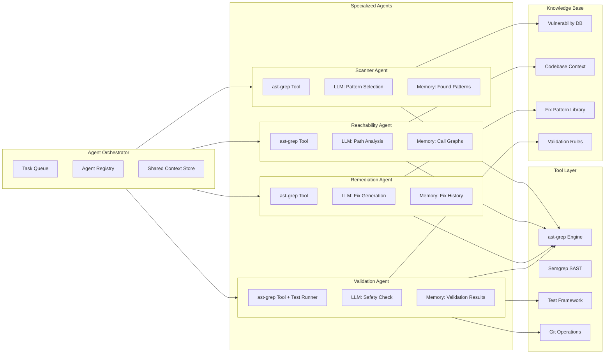
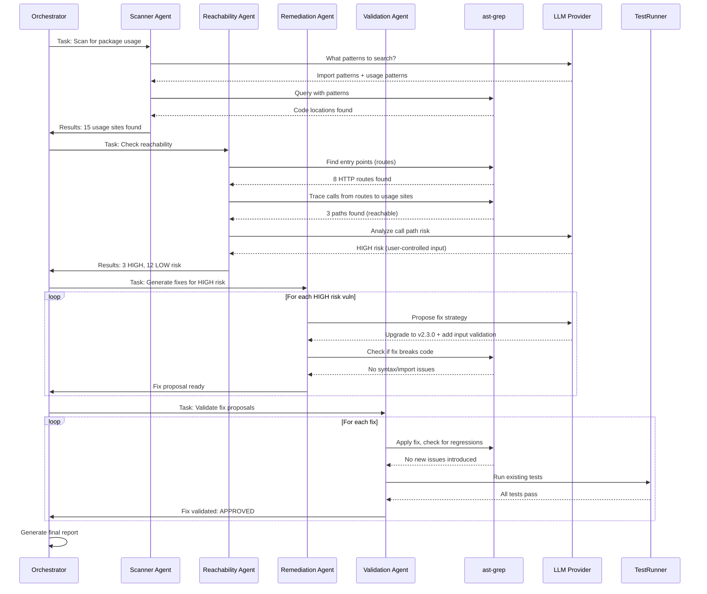
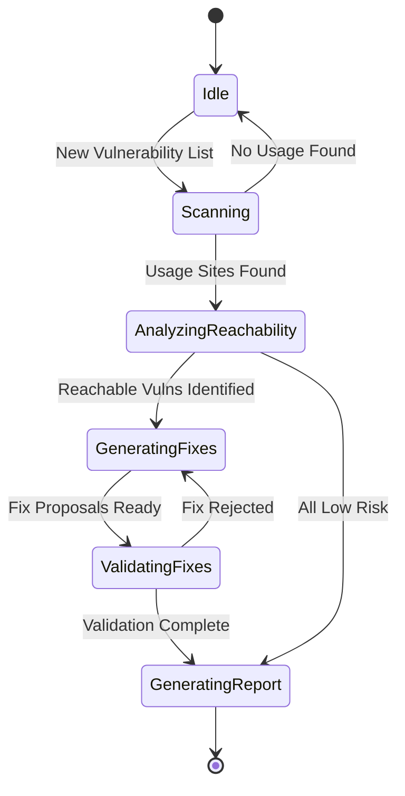
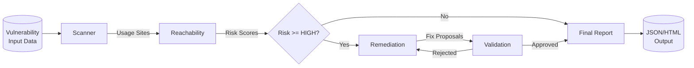

# Agent-Based Vulnerability Analysis Architecture

## Overview
This flowchart describes the proposed agent-based workflow for vulnerability analysis using ast-grep as the code parsing foundation. The system uses specialized agents that iteratively analyze, validate, and remediate security findings.

## High-Level Agent Flow



## Detailed Agent Architecture



## Agent Communication Flow



## Agent Implementation Details

### 1. Scanner Agent
**Purpose**: Find all usage sites of vulnerable packages using ast-grep

**Tools**:
- ast-grep for code queries
- LLM for pattern generation

**Workflow**:
1. Receive vulnerable package name + language
2. Ask LLM: "What import/usage patterns should I search for?"
3. Generate ast-grep queries (e.g., `import $PKG`, `$PKG.$METHOD(...)`)
4. Execute queries across codebase
5. Store results with file, line, context

**Memory**:
- Pattern library (learning from past scans)
- False positive tracking

### 2. Reachability Agent
**Purpose**: Determine if vulnerable code is reachable from entry points

**Tools**:
- ast-grep for call graph traversal
- LLM for risk assessment

**Workflow**:
1. Receive usage sites from Scanner Agent
2. Use ast-grep to find entry points (HTTP routes, CLI handlers)
3. Trace call paths from entry → usage site
4. For each path, analyze:
   - User input involvement?
   - Auth/validation barriers?
   - Error handling?
5. Ask LLM to score risk (0-10)
6. Return scored findings

**Memory**:
- Call graph cache
- Entry point registry

### 3. Remediation Agent
**Purpose**: Generate safe, validated fix proposals

**Tools**:
- ast-grep for code validation
- LLM for fix generation
- Fix pattern library

**Workflow**:
1. Receive HIGH risk vulnerabilities
2. For each vuln:
   - Query fix pattern library (known fixes)
   - If none, ask LLM: "How to fix this safely?"
   - LLM proposes: upgrade, refactor, or mitigation
3. Use ast-grep to validate fix:
   - Check syntax correctness
   - Verify imports resolve
   - Ensure no new anti-patterns
4. Iteratively refine with LLM if issues found
5. Store approved fix

**Memory**:
- Fix pattern library (grows over time)
- Failed fix attempts (avoid repetition)

### 4. Validation Agent
**Purpose**: Ensure fixes don't break functionality

**Tools**:
- ast-grep for regression detection
- Test runner (pytest, jest, junit)
- Git operations for safe testing

**Workflow**:
1. Receive fix proposals
2. Create temporary git branch
3. Apply fix
4. Run ast-grep queries:
   - Check for new vulnerabilities
   - Verify no import/syntax errors
   - Detect breaking API changes
5. Run existing test suite
6. If all pass → APPROVE
7. If fail → REJECT with reason
8. Clean up branch

**Memory**:
- Validation history
- Test failure patterns

## Agent State Machine



## Data Flow Between Agents



## Technology Stack

### Core Components
- **ast-grep**: Foundation for all code analysis
- **LangChain / LlamaIndex**: Agent framework and orchestration
- **LLM Provider**: OpenAI, Anthropic, or local Ollama
- **Python asyncio**: Concurrent agent execution

### ast-grep Integration
```python
# Example ast-grep query structure
query = {
    "rule": {
        "pattern": "import $PACKAGE",
        "language": "python"
    },
    "constraints": {
        "PACKAGE": {"regex": "^(requests|urllib)$"}
    }
}
```

### Agent Framework
```python
from langchain.agents import Agent, Tool
from ast_grep_py import AstGrep

class ScannerAgent(Agent):
    tools = [
        Tool(name="ast-grep", func=ast_grep_search),
        Tool(name="llm", func=llm_call),
    ]
    
    def execute(self, task):
        # Agent logic with tool calls
        patterns = self.tools["llm"](f"Generate search patterns for {task.package}")
        results = self.tools["ast-grep"](patterns)
        return results
```

## Performance Considerations

### Parallel Execution
- Run Scanner Agent on multiple packages concurrently
- Reachability Agent processes findings in parallel
- Validation Agent tests fixes independently

### Caching Strategy
- Cache ast-grep parse trees (per file)
- Cache LLM responses for similar queries
- Store call graph for reuse

### Resource Limits
- Max concurrent agents: 5
- LLM rate limiting: 10 requests/min
- ast-grep timeout: 30s per query
- Agent timeout: 5min per task

## Success Metrics

1. **Accuracy**: % of true positives (reachability detection)
2. **Coverage**: % of codebase analyzed
3. **Fix Quality**: % of validated fixes that pass tests
4. **Speed**: Time per vulnerability analyzed
5. **Agent Efficiency**: Avg. tool calls per successful analysis

## Implementation Phases

### Phase 1: ast-grep Foundation (Current)
- Install and configure ast-grep
- Build query library for Python, Java, JavaScript
- Replace regex-based analyzers

### Phase 2: Simple Agent (Next)
- Single Scanner Agent with ast-grep tool
- Basic LLM integration for pattern generation
- No orchestration yet

### Phase 3: Multi-Agent System
- Add Reachability, Remediation, Validation agents
- Implement agent orchestrator
- Shared context store

### Phase 4: Production Hardening
- Add caching, retries, error handling
- Performance optimization
- Comprehensive testing

## Next Steps

1. ✅ Create ast-grep foundation
2. ⬜ Implement base Agent class
3. ⬜ Build Scanner Agent
4. ⬜ Add Reachability Agent
5. ⬜ Integrate LLM with agents
6. ⬜ Add Remediation Agent
7. ⬜ Build Validation Agent
8. ⬜ Implement Orchestrator
9. ⬜ End-to-end testing
10. ⬜ Production deployment
