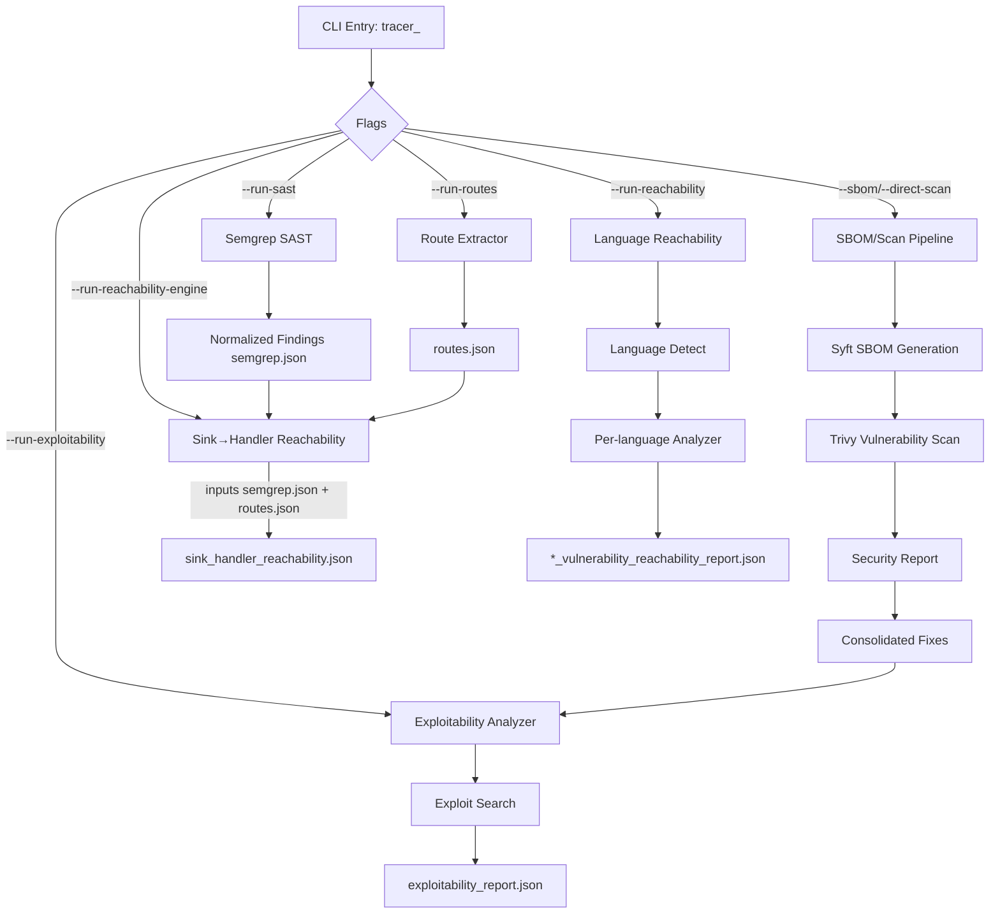

# Architecture Flowchart

```mermaid
flowchart TD
    A[CLI Entry: tracer_] --> B{Flags}
    B -->|--sbom/--direct-scan| C[SBOM/Scan Pipeline]
    B -->|--run-sast| D[Semgrep SAST]
    B -->|--run-routes| E[Route Extractor]
    B -->|--run-reachability-engine| F[Sink→Handler Reachability]
    B -->|--run-reachability| G[Language Reachability]
    B -->|--run-exploitability| H[Exploitability Analyzer]

    C --> C1[Syft SBOM Generation]
    C1 --> C2[Trivy Vulnerability Scan]
    C2 --> C3[Security Report]
    C3 --> C4[Consolidated Fixes]

    D --> D1[Normalized Findings semgrep.json]

    E --> E1[routes.json]

    F -->|inputs semgrep.json + routes.json| F1[sink_handler_reachability.json]

    G --> G1[Language Detect]
    G1 --> G2[Per-language Analyzer]
    G2 --> G3[*_vulnerability_reachability_report.json]

    H --> H1[Exploit Search]
    H1 --> H2[exploitability_report.json]

    C4 --> H
    D1 --> F
    E1 --> F
```

