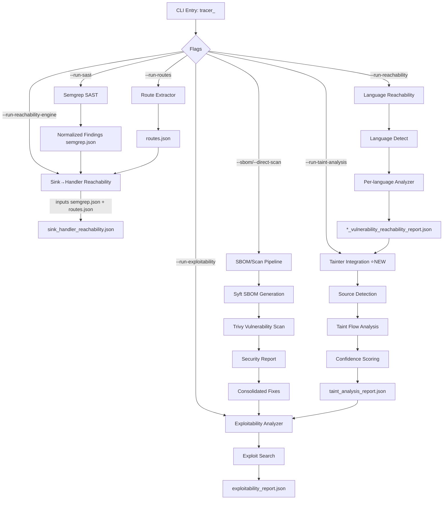
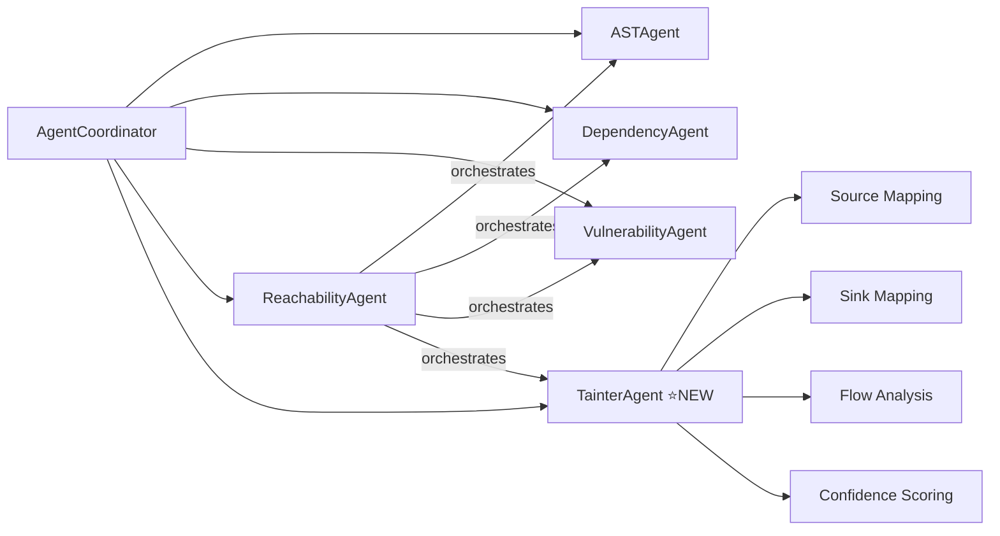
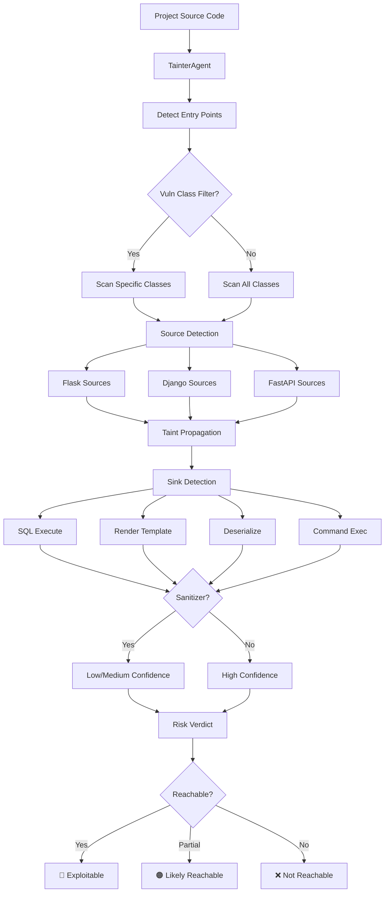

# Architecture Flowchart

## Main Pipeline

```mermaid
flowchart TD
    A[CLI Entry: tracer_] --> B{Flags}
    B -->|--sbom/--direct-scan| C[SBOM/Scan Pipeline]
    B -->|--run-sast| D[Semgrep SAST]
    B -->|--run-routes| E[Route Extractor]
    B -->|--run-reachability-engine| F[Sink→Handler Reachability]
    B -->|--run-reachability| G[Language Reachability]
    B -->|--run-exploitability| H[Exploitability Analyzer]
    B -->|--run-taint-analysis| T[Tainter Integration ⭐NEW]

    C --> C1[Syft SBOM Generation]
    C1 --> C2[Trivy Vulnerability Scan]
    C2 --> C3[Security Report]
    C3 --> C4[Consolidated Fixes]

    D --> D1[Normalized Findings semgrep.json]

    E --> E1[routes.json]

    F -->|inputs semgrep.json + routes.json| F1[sink_handler_reachability.json]

    G --> G1[Language Detect]
    G1 --> G2[Per-language Analyzer]
    G2 --> G3[*_vulnerability_reachability_report.json]

    H --> H1[Exploit Search]
    H1 --> H2[exploitability_report.json]

    T --> T1[Source Detection]
    T1 --> T2[Taint Flow Analysis]
    T2 --> T3[Confidence Scoring]
    T3 --> T4[taint_analysis_report.json]

    C4 --> H
    D1 --> F
    E1 --> F
    G3 --> T
    T4 --> H
```

## Agent-Based Architecture (With Tainter)

```mermaid
flowchart LR
    A[AgentCoordinator] --> B[ASTAgent]
    A --> C[DependencyAgent]
    A --> D[VulnerabilityAgent]
    A --> E[ReachabilityAgent]
    A --> F[TainterAgent ⭐NEW]
    
    F --> F1[Source Mapping]
    F --> F2[Sink Mapping]
    F --> F3[Flow Analysis]
    F --> F4[Confidence Scoring]
    
    E -->|orchestrates| B
    E -->|orchestrates| C
    E -->|orchestrates| D
    E -->|orchestrates| F
```

## Tainter Taint Analysis Flow

```mermaid
flowchart TD
    Start[Project Source Code] --> A[TainterAgent]
    A --> B[Detect Entry Points]
    B --> C{Vuln Class Filter?}
    C -->|Yes| D[Scan Specific Classes]
    C -->|No| E[Scan All Classes]
    
    D --> F[Source Detection]
    E --> F
    
    F --> F1[Flask Sources]
    F --> F2[Django Sources]
    F --> F3[FastAPI Sources]
    
    F1 --> G[Taint Propagation]
    F2 --> G
    F3 --> G
    
    G --> H[Sink Detection]
    H --> H1[SQL Execute]
    H --> H2[Render Template]
    H --> H3[Deserialize]
    H --> H4[Command Exec]
    
    H1 --> I{Sanitizer?}
    H2 --> I
    H3 --> I
    H4 --> I
    
    I -->|Yes| J[Low/Medium Confidence]
    I -->|No| K[High Confidence]
    
    J --> L[Risk Verdict]
    K --> L
    
    L --> M{Reachable?}
    M -->|Yes| N[🔴 Exploitable]
    M -->|Partial| O[🟠 Likely Reachable]
    M -->|No| P[❌ Not Reachable]
```

