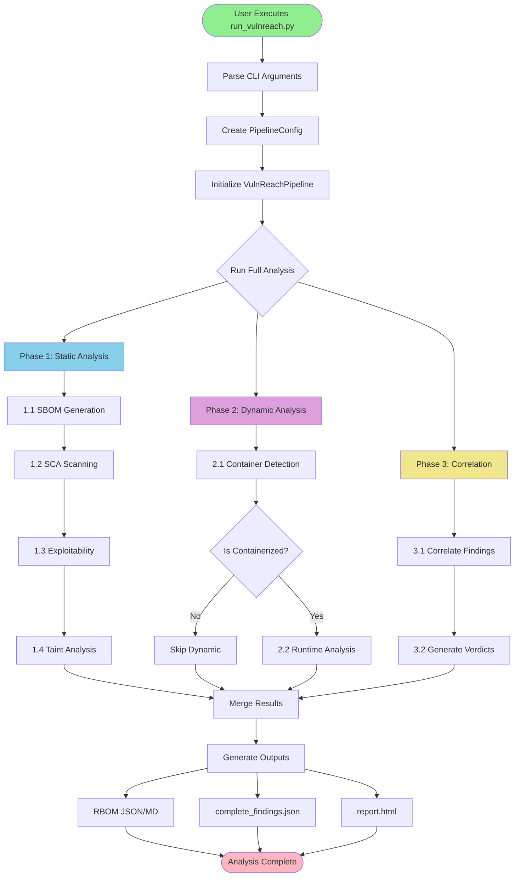
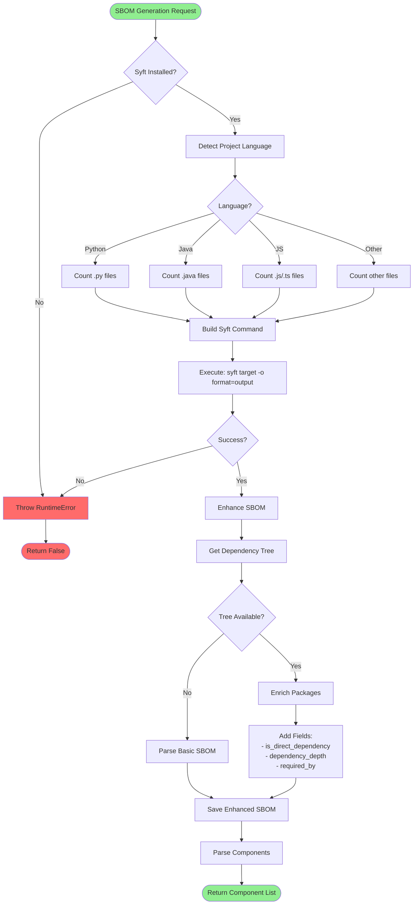
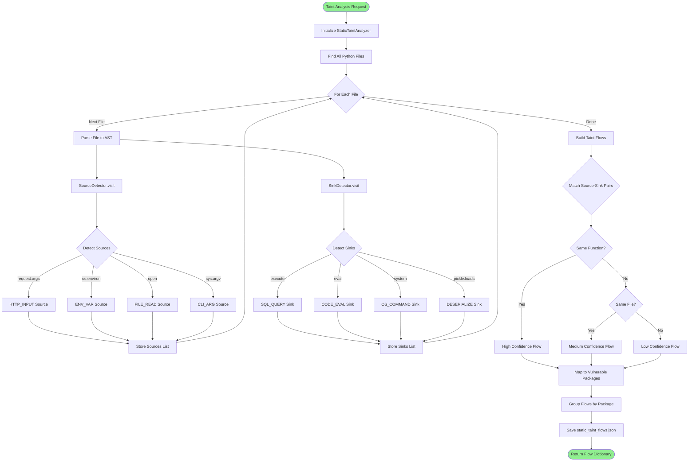
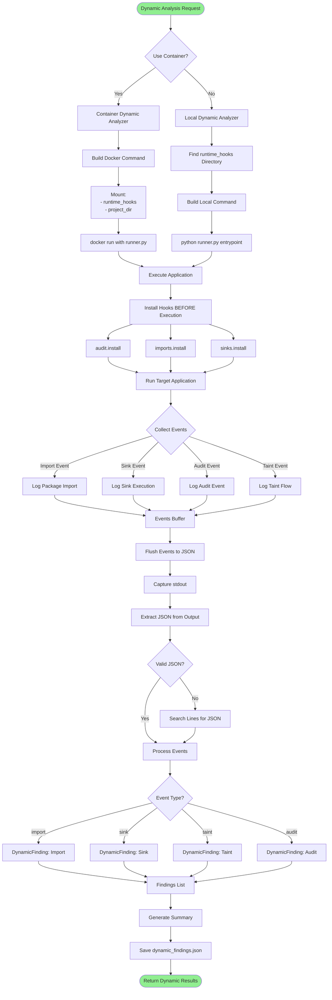
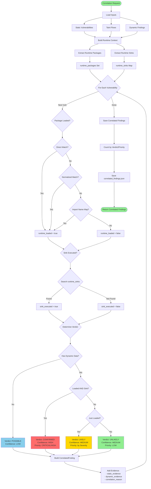
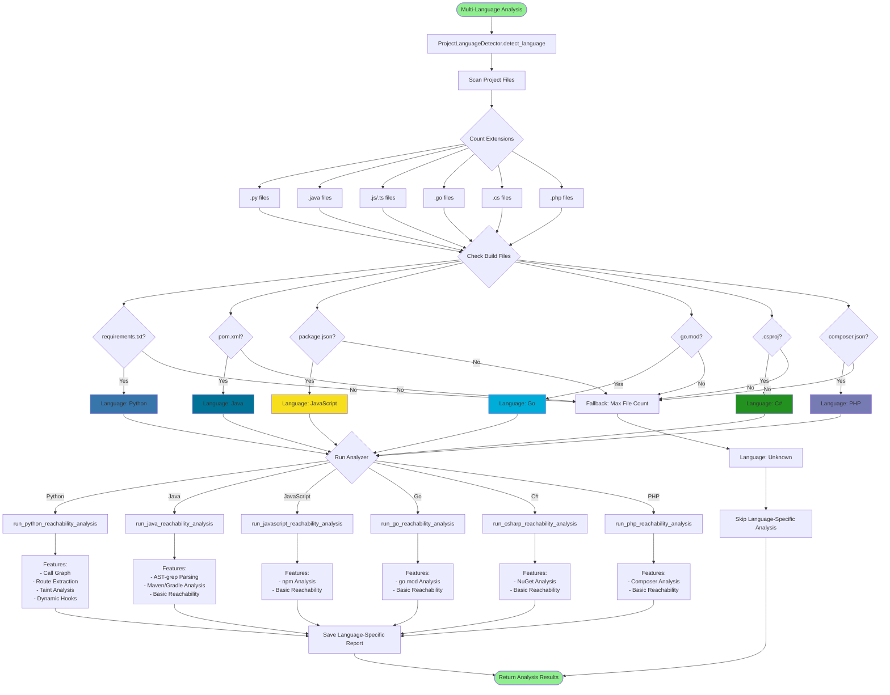
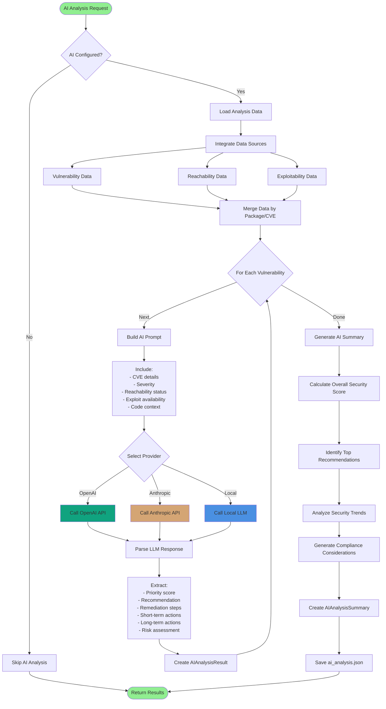
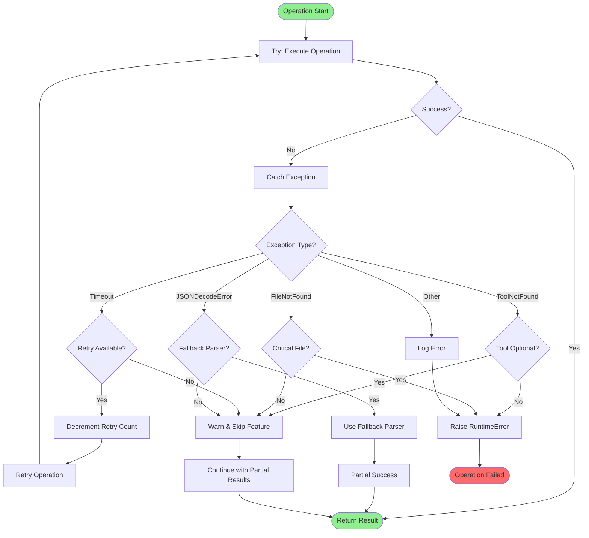
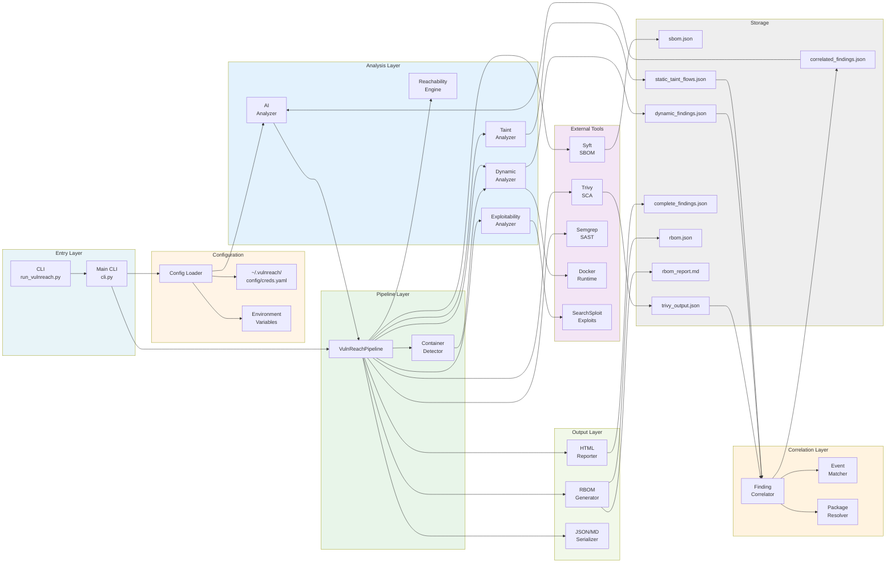

# VulnReach Complete System Flow

This document contains detailed flowcharts showing all execution paths and component interactions.

---

## 1. Main Pipeline Flow



---

## 2. SBOM Generation Flow



---

## 3. Static Taint Analysis Flow



---

## 4. Dynamic Analysis Flow



---

## 5. Correlation Engine Flow



---

## 6. Multi-Language Detection & Analysis



---

## 7. RBOM Generation Flow

```mermaid
flowchart TD
    Start([RBOM Generation]) --> CreateBuilder[Create RBOMBuilder]
    
    CreateBuilder --> SetTarget[Set Target Info]
    SetTarget --> AddComponents[Add Components from SBOM]
    
    AddComponents --> LoopComponents{For Each Component}
    LoopComponents -->|Next| CreateComponent[Create RBOMComponent]
    LoopComponents -->|Done| AddVulns[Add Vulnerabilities]
    
    CreateComponent --> SetCompFields[Set Fields:<br/>- name<br/>- version<br/>- purl<br/>- licenses]
    SetCompFields --> LoopComponents
    
    AddVulns --> LoopVulns{For Each Vulnerability}
    LoopVulns -->|Next| MapComponent[Map to Component]
    LoopVulns -->|Done| AddExecution[Add Execution Summary]
    
    MapComponent --> FindCorr[Find Correlated Finding]
    FindCorr --> CorrExists{Correlation Exists?}
    
    CorrExists -->|Yes| ExtractVerdict[Extract:<br/>- verdict<br/>- confidence<br/>- priority]
    CorrExists -->|No| DefaultVerdict[Default:<br/>- POSSIBLE<br/>- LOW<br/>- by Severity]
    
    ExtractVerdict --> BuildRuntime[Build Runtime Evidence]
    DefaultVerdict --> BuildRuntime
    
    BuildRuntime --> DynamicCheck{Has Dynamic Data?}
    DynamicCheck -->|Yes| SetRuntime[Set:<br/>- package_loaded<br/>- sink_executed<br/>- execution_count]
    DynamicCheck -->|No| NoRuntime[runtime_evidence = null]
    
    SetRuntime --> BuildStatic[Build Static Evidence]
    NoRuntime --> BuildStatic
    
    BuildStatic --> TaintCheck{Has Taint Flows?}
    TaintCheck -->|Yes| SetTaint[Set taint_flows]
    TaintCheck -->|No| NoTaint[taint_flows = []]
    
    SetTaint --> BuildExploit[Build Exploit Evidence]
    NoTaint --> BuildExploit
    
    BuildExploit --> ExploitCheck{Has Exploits?}
    ExploitCheck -->|Yes| SetExploits[Set:<br/>- public_exploits<br/>- exploit_maturity]
    ExploitCheck -->|No| NoExploits[exploit_evidence = null]
    
    SetExploits --> CreateVulnReach[Create VulnerabilityReachability]
    NoExploits --> CreateVulnReach
    
    CreateVulnReach --> AddToVulns[Add to Vulnerabilities List]
    AddToVulns --> LoopVulns
    
    AddExecution --> CalcStats[Calculate Statistics:<br/>- total_components<br/>- total_vulnerabilities<br/>- by_verdict<br/>- by_priority]
    
    CalcStats --> SetAnalysisInfo[Set Analysis Info:<br/>- timestamp<br/>- duration<br/>- phases_completed]
    
    SetAnalysisInfo --> BuildRBOM[Build RBOM Object]
    BuildRBOM --> Serialize[Serialize RBOM]
    
    Serialize --> ToJSON[RBOMSerializer.to_json]
    Serialize --> ToMarkdown[RBOMSerializer.to_markdown]
    
    ToJSON --> SaveJSON[Save rbom.json]
    ToMarkdown --> SaveMD[Save rbom_report.md]
    
    SaveJSON --> Return([Return RBOM])
    SaveMD --> Return
    
    style Start fill:#90EE90
    style Return fill:#90EE90
```

---

## 8. AI Analysis Flow



---

## 9. Reachability Scoring Engine

```mermaid
flowchart TD
    Start([Reachability Engine]) --> LoadSemgrep[Load semgrep.json]
    LoadSemgrep --> LoadRoutes[Load routes.json]
    
    LoadRoutes --> LoopFindings{For Each SAST Finding}
    LoopFindings -->|Next| ExtractInfo[Extract:<br/>- rule_id<br/>- file<br/>- line<br/>- sink_function<br/>- severity]
    LoopFindings -->|Done| SaveResults[Save Results]
    
    ExtractInfo --> FindHandler[Find Enclosing Handler]
    FindHandler --> DetectLang{File Extension?}
    
    DetectLang -->|.py| PyHandler[Parse Python Functions]
    DetectLang -->|.js| JSHandler[Parse JavaScript Functions]
    DetectLang -->|.java| JavaHandler[Parse Java Methods]
    
    PyHandler --> CheckLine{Line in Function?}
    JSHandler --> CheckLine
    JavaHandler --> CheckLine
    
    CheckLine -->|Yes| HandlerFound[handler = function_name]
    CheckLine -->|No| NoHandler[handler = null]
    
    HandlerFound --> MatchRoute[Match Handler to Route]
    NoHandler --> MatchRoute
    
    MatchRoute --> SearchRoutes{Search routes.json}
    SearchRoutes -->|Match File| CheckHandler{Handler Match?}
    SearchRoutes -->|No Match| NoRoute[route = null]
    
    CheckHandler -->|Yes| RouteFound[route = route_obj]
    CheckHandler -->|No| NoRoute
    
    RouteFound --> ComputeScore[Compute Reachability Score]
    NoRoute --> ComputeScore
    
    ComputeScore --> BaseScore[Base Score = 0.0]
    BaseScore --> AddHandler{Has Handler?}
    
    AddHandler -->|Yes| Plus04[+ 0.4]
    AddHandler -->|No| Plus02[+ 0.2]
    
    Plus04 --> AddRoute{Has Route?}
    Plus02 --> AddRoute
    
    AddRoute -->|Yes| Plus03[+ 0.3]
    AddRoute -->|No| NoRoutePlus[+ 0.0]
    
    Plus03 --> AddTaint{Has Taint Hint?}
    NoRoutePlus --> AddTaint
    
    AddTaint -->|Yes| Plus02T[+ 0.2]
    AddTaint -->|No| NoTaintPlus[+ 0.0]
    
    Plus02T --> AddSeverity{Severity?}
    NoTaintPlus --> AddSeverity
    
    AddSeverity -->|CRITICAL/HIGH| Plus01[+ 0.1]
    AddSeverity -->|MEDIUM| Plus005[+ 0.05]
    AddSeverity -->|LOW| NoSevPlus[+ 0.0]
    
    Plus01 --> FinalScore[Final Score = min(sum, 1.0)]
    Plus005 --> FinalScore
    NoSevPlus --> FinalScore
    
    FinalScore --> FilterScore{Score >= 0.4?}
    FilterScore -->|No| LoopFindings
    FilterScore -->|Yes| BuildReason[Build Reason String]
    
    BuildReason --> CreateFinding[Create ReachabilityFinding]
    CreateFinding --> LoopFindings
    
    SaveResults --> SaveJSON[Save sink_handler_reachability.json]
    SaveJSON --> Return([Return Findings])
    
    style Start fill:#90EE90
    style Return fill:#90EE90
```

---

## 10. Configuration Loading Flow

```mermaid
flowchart TD
    Start([Configuration Request]) --> GetLoader[get_config_loader]
    GetLoader --> SingletonCheck{Loader Exists?}
    
    SingletonCheck -->|Yes| ReturnExisting[Return Existing Loader]
    SingletonCheck -->|No| CreateNew[Create ConfigLoader]
    
    CreateNew --> FindConfig[Find Config File]
    FindConfig --> CheckHome{~/.vulnreach/config/creds.yaml exists?}
    
    CheckHome -->|Yes| LoadYAML[Load YAML File]
    CheckHome -->|No| UseDefaults[Use Default Config]
    
    LoadYAML --> ParseYAML[Parse YAML]
    ParseYAML --> ValidateSchema{Valid Schema?}
    
    ValidateSchema -->|No| LogWarning[Log Warning]
    ValidateSchema -->|Yes| ExtractProviders[Extract Providers]
    
    LogWarning --> UseDefaults
    
    ExtractProviders --> CheckProviders{Has Providers?}
    CheckProviders -->|Yes| SetProviders[Set Provider Configs]
    CheckProviders -->|No| NoProviders[providers = []]
    
    SetProviders --> BuildConfig[Build VulnReachConfig]
    NoProviders --> BuildConfig
    UseDefaults --> BuildConfig
    
    BuildConfig --> CheckEnv[Check Environment Variables]
    CheckEnv --> OverrideCheck{Env Vars Set?}
    
    OverrideCheck -->|Yes| Override[Override Config with Env]
    OverrideCheck -->|No| FinalConfig[Finalize Config]
    
    Override --> EnvVars[Apply:<br/>- LLM_HOST<br/>- LLM_TIMEOUT<br/>- VULNREACH_AI_MOCK<br/>- etc.]
    
    EnvVars --> FinalConfig
    FinalConfig --> CacheConfig[Cache Configuration]
    CacheConfig --> ReturnExisting
    
    ReturnExisting --> Return([Return Config])
    
    style Start fill:#90EE90
    style Return fill:#90EE90
```

---

## 11. Error Handling & Recovery Paths



---

## 12. Complete System Component Interaction



---

## Legend

### Node Colors
- 🟢 **Green** - Start/End points, Success states
- 🔵 **Blue** - Processing/Analysis phases
- 🟡 **Yellow** - Decision points
- 🔴 **Red** - Error states, Critical priorities
- 🟣 **Purple** - External tools/services

### Flow Directions
- **Top-Down (TD)** - Sequential processing
- **Left-Right (LR)** - Component interactions
- **Subgraphs** - Logical groupings

### Decision Diamonds
- `{Condition?}` - Yes/No branches
- `{Switch}` - Multiple outcome branches

---

**Document Maintenance:**
- Update when new flows are added
- Review during architecture changes
- Validate with actual code during refactoring

**Last Updated:** February 14, 2026

